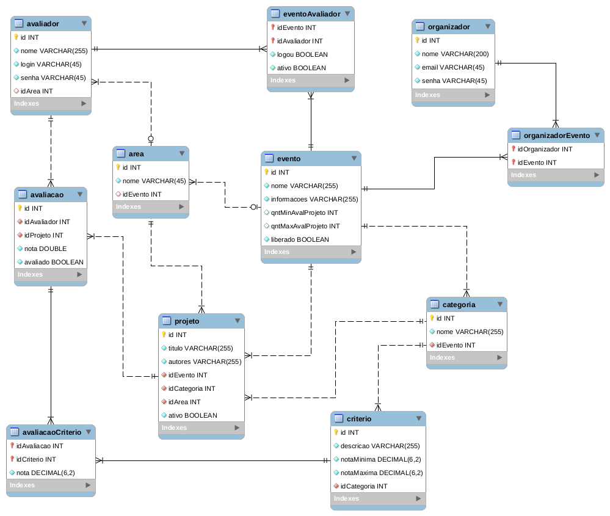

# Sistema Gerenciador de Avaliações - Projeto

## Banco de Dados

## Protótipos
[Telas Desktop](https://www.figma.com/proto/yCBlnKtHWTW1Gj8LLyQpeI/Sistema-de-Avalia%C3%A7%C3%B5es---Telas?node-id=16%3A0&scaling=scale-down)

## Exemplos de Telas
[Projeto Desktop](https://www.dropbox.com/s/5x8usvgy0ioh612/telasDesktop.zip?dl=0)

## Atividades/Tarefas Iniciais

* Levantar os requisitos
* Criar o fluxograma (navegação entre as telas)
* Criar o Diagrama de Classe (simplificado)
* Criar a base de dados (diagrama e SQL)

## Requisitos

### Cadastros
* Eventos (form)
    * Área (Ciências da Natureza, Tecnologia da Informação...) - importação e form
    * Categoria dos projetos (banner, relato de experiência...) - importação e form
        * Critérios de avaliação (nota) - form
* Projetos e nomes dos autores (já aprovados) - importação e form
* Organizadores - form
* Avaliadores - importação e form

### Ações do Sistema
* Liberar e bloquear avaliação do evento
* Distribuir projetos para os avaliadores
    * Simular, exibir projeções da divisão, automática e manual
* Calcular as notas dos projetos (média...)
* Exibir a classificação (posição considerando as notas)
* Imprimir a lista de projetos com números (classificar por área)
* Exibir informações sobre a quantidade de avaliações de cada projeto (se já foi avaliado x vezes, não é exibido mais, quantidade de avaliações feitas, quanto falta...)
* Exibir avaliadores que já se logaram
* Exibir os projetos a serem avaliados para os avaliadores
* Devolver o projeto para o avaliador
* Desativar projetos, avaliadores...
* Lista de projetos apresentados/não apresentados
* Definir mínimo e máximo de avaliações por projeto

### Ações/atividades futuras
* Votação dos visitantes
* Problema: 1 autor com mais de um projeto em um evento com mais de um dia

## Desenvolvedores
* Alexandre
* Bruno Geovane Barros Alves
* Marcos Winicios
* Hiago Foppa
* Giovane Álvares
* Edson Rodrigues
* Marcos Dourado
* Marcos Lima
* Márcia Linhares
* Gustavo Faquim
